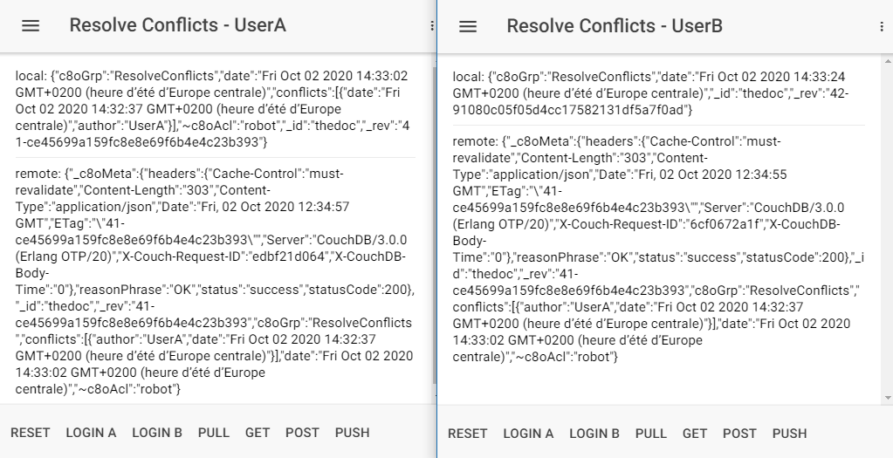
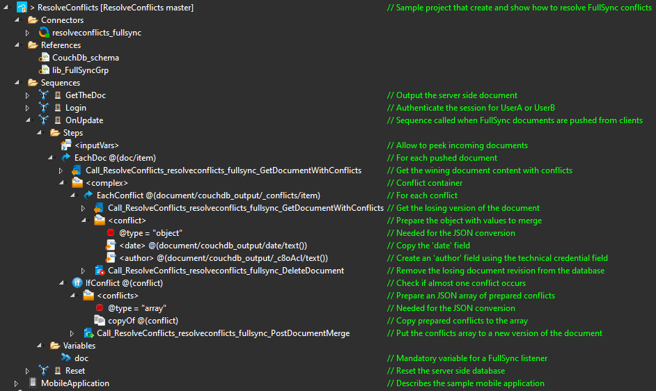

# ResolveConflicts

**ResolveConflicts** is a [Convertigo](https://www.convertigo.com) projects. This is a sample to show how a Convertigo server can solve a FullSync document conflict.

## Import

Use the project **remoteURL** field from the Convertigo import function:

```
ResolveConflicts=git@github.com:convertigo/c8oprj-sample-resolveconflicts.git:branch=master
```

### Dependency

The standard **lib_FullSyncGrp** project is mandatory to run this sample.

## Use Case

This is a simple case of 2 users working on the same FullSync document, on their device, not connected. Both will produce a new version of the same document. When their documents are pushed to the Convertigo server, only one version will be official. The other one is a *conflict* document version.

This project will create a new document version enhanced with a part of the conflict version.

## Usage

Once the project deployed, you need 2 browser sessions (one launched with the private mode) in order to not mix cookies/sessions. 

+ In one instance, press **Login A**. For the other instance, press **Login B**.
+ The **User A** will press **POST** to create the document, then **PUSH** to publish it on the server.
+ The **User B** will press **PULL** to sync the document.
+ Both **User A** and **User B** will press **POST** and **PUSH**, generating 2 different versions of the same document.
+ The server will automatically process the 2 versions of this document.
+ When we press **PULL** for both users, they will received a new version of the document with the conflict inside.

Other buttons:
+ The **Get** button can be used to see the content of the official document on the server.
+ The **Reset** button clean the local device database.



## Structure

This is a screenshot of the project, focused on the conflict resolution Sequence:

